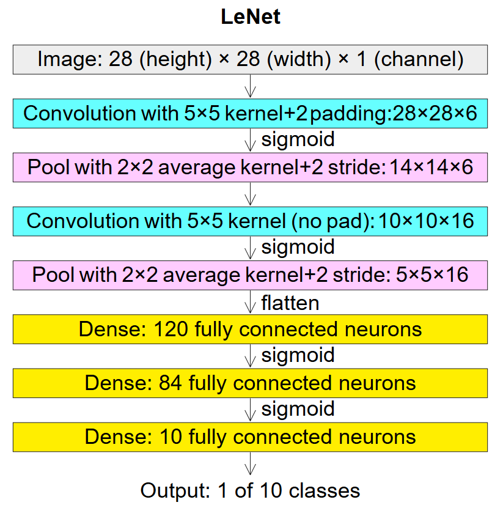
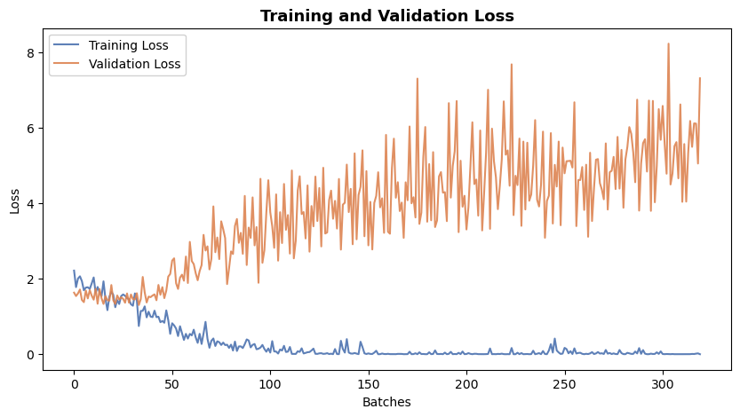
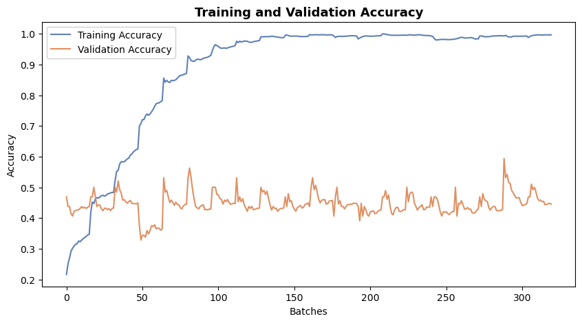
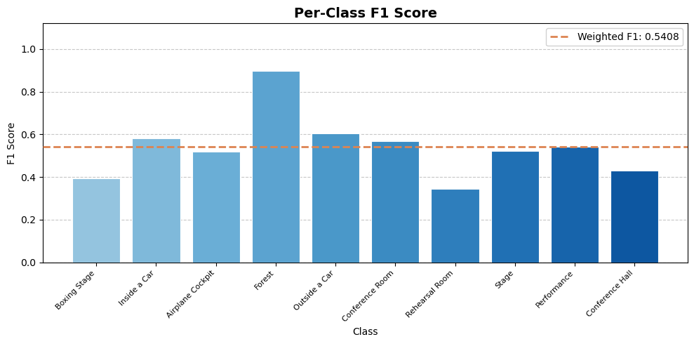
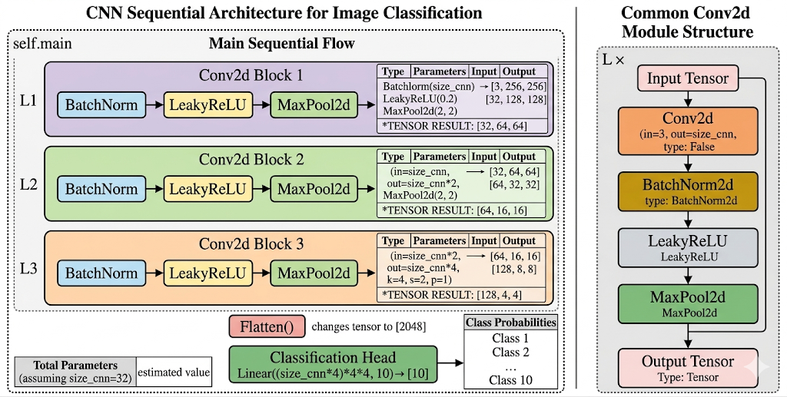
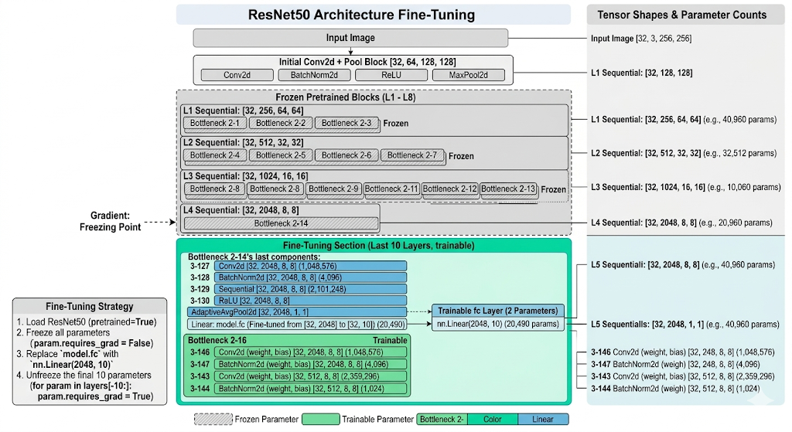
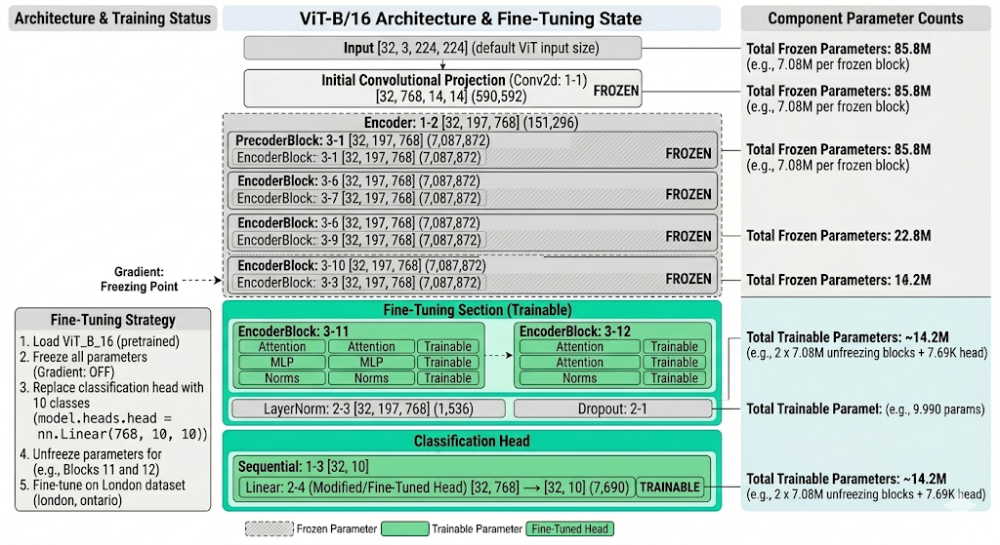

## Place365 Images Classification Project Report

### Dataset

This project implements and compares multiple neuro network architectures for scene classification. The applying is a subset of `Places365` - `Places365 Mini Hard`.

The Places365 dataset is designed following principles of human visual cognition. It is good for training artificaial system of high-level visual understanding tasks. The dataset contains more than 10 million images comprising 400+ unique scene categories. The dataset features 5000 to 30,000 training images per class, consistent with real-world frequencies of occurrence.

`Places365 Mini Hard` is a challenging subset of the Places365 scene recognition dataset, containing 10 scene categories.

| Label | Class Name       |
|-------|-----------------|
| 0     | Boxing Stage     |
| 1     | Inside a Car     |
| 2     | Airplane Cockpit |
| 3     | Forest           |
| 4     | Outside a Car    |
| 5     | Conference Room  |
| 6     | Rehearsal Room   |
| 7     | Stage            |
| 8     | Performance      |
| 9     | Conference Hall  |

### Using Instructions

+ Step 1: Open `DownloadetRemote.ipynb`, running the code of first cell, download the dataset from the remote server and save them to local folder `./data/*`

+ Step 2: Run the following file to execute the detailed code for the four models.

| Model      | Notebook                   |
|------------|----------------------------|
| SimpleCNN  | CNNClassfication.ipynb     |
| LeNet      | LeNetClassfication.ipynb   |
| ResNet50   | ResNetClassfication.ipynb  |
| ViT-B/16   | ViTClassfication.ipynb     |

The functions are explained as follows:

1. Loading files from the local folder and previewing them, I noticed that the image sizes are different.

2. Resize the images to 256 X 256; for the ViT model, resize them to 224 X 224 (as required by the pre-trained model). Then save them as `train_loader.pt` and `test_loader.pt`.

For time savings, the data will be loaded at the adjusted size the next time you use it.

3. Define the model structure separately.

4. Training, validation, and evaluation of the model. Then save the model parameters to a file.

5. Plot training and validation loss and accuracy. Confusion matrix on test data. F1 score on test data.

### Models

#### LeNet

LeNet is a series of convolutional neural network architectures created by a research group in AT&T Bell Laboratories during the 1988 to 1998 period, centered around Yann LeCun. I used the version is public in 1998, it is the most well-known version. It is also sometimes called LeNet-5.

The structure of LeNet is fixed, it applied big kernel size 5, 2 convolutional layers and 3 full connections layers.

After 20 epoch iterations, The training loss has tended to stabilize, but the validation loss is not very stable, and there has been no significant improvement. 

Finally, the F1 Score is 0.5408.

#### Simple CNN

Simple CNN 是现代典型基础网络结构，倾向于较小的卷积核 (例如 3x3)，结构比较灵活，2-3层卷积层，1-2层全连接层，网络结构如下图。

#### Transfer Learning - ResNet50

#### Transfer Learning - Vit-B/16

