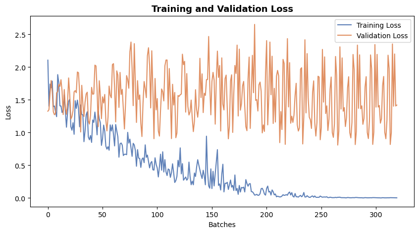
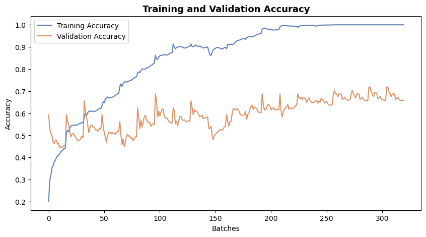
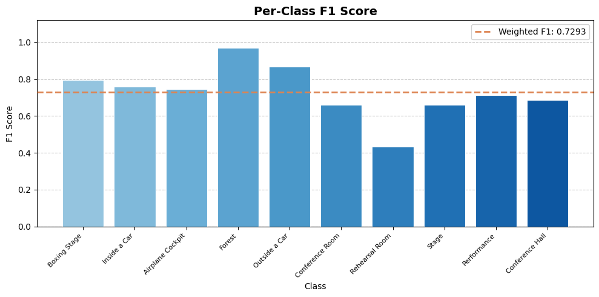
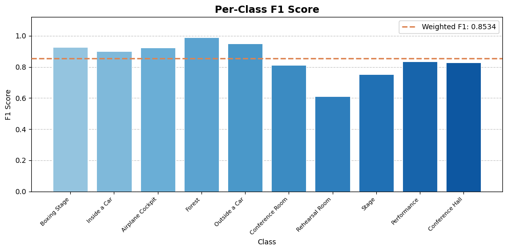
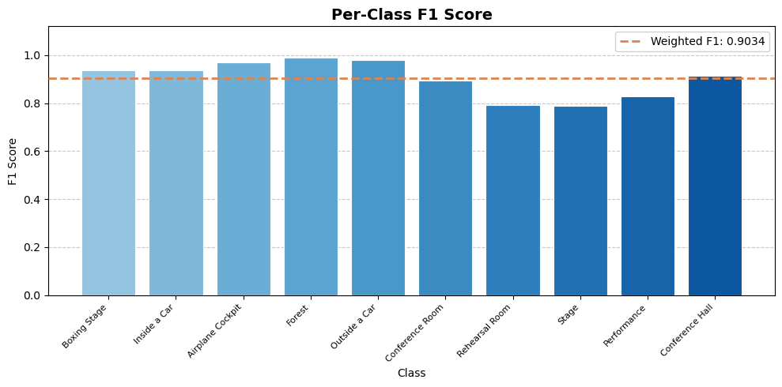

## Places365 Scene Classification — Project Report

---

### Dataset

This project implements and compares four neural network architectures for scene classification using the **Places365 Mini Hard** dataset.

The Places365 dataset was designed following principles of human visual cognition, making it well-suited for training systems on high-level visual understanding tasks. It contains over 10 million images spanning 400+ unique scene categories, with 5,000 to 30,000 training images per class, reflecting real-world scene frequencies.

**Places365 Mini Hard** is a challenging subset of Places365 containing 10 scene categories:

| Label | Class Name       |
|-------|-----------------|
| 0     | Boxing Stage     |
| 1     | Inside a Car     |
| 2     | Airplane Cockpit |
| 3     | Forest           |
| 4     | Outside a Car    |
| 5     | Conference Room  |
| 6     | Rehearsal Room   |
| 7     | Stage            |
| 8     | Performance      |
| 9     | Conference Hall  |

---

### Usage Instructions

**Step 1 — Download the dataset**

Open `DownloaderRemote.ipynb` and run the first cell. This downloads the Places365 Mini Hard dataset from HuggingFace and saves it to `./data/`.

**Step 2 — Run a model notebook**

Open any of the four model notebooks and run all cells in order:

| Model      | Notebook                    |
|------------|-----------------------------|
| SimpleCNN  | `CNNClassfication.ipynb`    |
| LeNet      | `LeNetClassfication.ipynb`  |
| ResNet50   | `ResNetClassfication.ipynb` |
| ViT-B/16   | `ViTClassfication.ipynb`    |

Each notebook follows the same pipeline:

1. Load images from `./data/` and preview them. I noticed that the original images vary in size.
2. Resize all images to 256×256 (or 224×224 for ViT, as required by the pretrained model), then save the result as `train_loader.pt` and `test_loader.pt` to convenient for us to start the operation from the middle.
3. Define the model architecture.
4. Train, validate, and evaluate the model, then save the model weights to a file.
5. Plot training and validation loss/accuracy curves, a confusion matrix on the test set, and per-class F1 scores.

---

### Models

#### LeNet

LeNet is one of the earliest convolutional neural network architectures, developed at AT&T Bell Laboratories by a team led by Yann LeCun between 1988 and 1998. This project uses the 1998 release, commonly known as LeNet-5.

LeNet has a fixed structure: two convolutional layers with large 5×5 kernels, followed by three fully connected layers.

After 20 epochs, the training loss stabilized and approached zero, indicating overfitting. The validation loss remained unstable with no meaningful improvement.

The model achieved a weighted F1 score of **0.5408**, which reflects poor generalization given the limited capacity of the architecture for this task.

---

#### SimpleCNN

SimpleCNN follows a modern, compact CNN design — smaller 3×3 kernels, flexible depth with 2–3 convolutional layers, and 1–2 fully connected layers. The full architecture is shown below.

After 15 epochs, the accuracy curve flattened, suggesting the model had extracted most of the learnable signal from the relatively small training set.

The model achieved a weighted F1 score of **0.7293** — a clear improvement over LeNet, though still limited by the size of the dataset.

Given these limitations, transfer learning was explored as the next step.

---

#### Transfer Learning — ResNet50

ResNet50 (Residual Network, 50 layers) was proposed by Microsoft Research in 2015. It is a member of the ResNet family, which introduced the concept of **residual blocks** — shortcut connections that add the input of a block directly to its output. This design allows gradients to flow more freely during backpropagation, effectively solving the vanishing gradient problem that plagued very deep networks.

For fine-tuning, all layers were frozen except the last 10, which include part of Stage 4, the global average pooling layer, and the fully connected classification head. The fine-tuned portion of the network is illustrated below.

The model converged quickly: after just 10 epochs, it achieved a weighted F1 score of **0.8617**.

---

#### Transfer Learning — ViT-B/16

Finally, a Vision Transformer (ViT-B/16) was evaluated. ViT-B/16 is the base variant of the Vision Transformer with a patch size of 16×16. Unlike ResNet, it uses no convolutions — the image is split into fixed patches, which are linearly embedded and passed through 12 Transformer encoder blocks. While structurally simpler than ResNet50 in terms of inductive bias, it benefits enormously from large-scale pretraining.

For fine-tuning, only the last two encoder blocks (layers 11 and 12) and the classification head were unfrozen. The fine-tuned components are shown below.

After 10 epochs, the model achieved a weighted F1 score of **0.9034**, the highest among all four models.

---

### Conclusion

The table below summarizes the evaluation results for all models, sorted by weighted F1 score:

| Model      | Notebook                    | Batch Size | Epochs | Val Loss | Val Accuracy | Weighted F1 |
|------------|-----------------------------|-----------|--------|----------|--------------|-------------|
| LeNet      | `LeNetClassfication.ipynb`  | 32        | 20     | 5.0790   | 44.92%       | 0.5194      |
| SimpleCNN  | `CNNClassfication.ipynb`    | 16        | 20     | 1.9833   | 58.63%       | 0.6482      |
| SimpleCNN  | `CNNClassfication.ipynb`    | 32        | 20     | 1.5336   | 63.82%       | 0.6648      |
| ResNet50   | `ResNetClassfication.ipynb` | 32        | 10     | 0.3853   | 85.16%       | 0.8617      |
| ViT-B/16   | `ViTClassfication.ipynb`    | 32        | 10     | 0.5985   | 86.99%       | 0.9034      |

Transfer learning is a highly effective strategy for image classification tasks, especially when the available training data is limited. Pretrained models encode rich feature representations learned from millions of images, and fine-tuning them on a target task requires far fewer epochs while achieving substantially better accuracy than training from scratch.